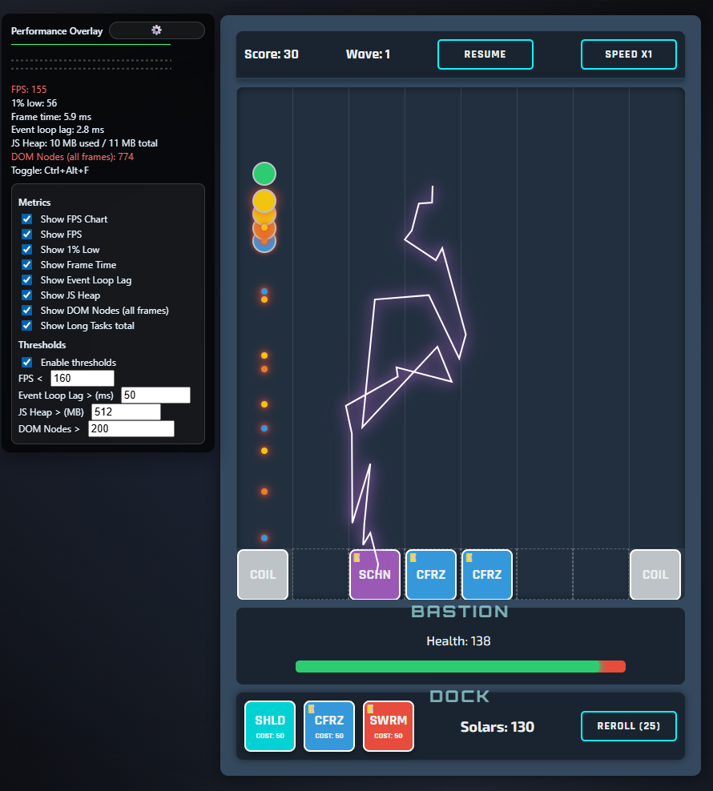

# FPS & Performance Overlay

A simple Chrome extension that shows a lightweight overlay with real-time performance metrics.  
Perfect for QA engineers, developers, and game testers who want to monitor FPS, frame time, memory usage, and other browser performance stats **without opening DevTools**.

---

## ✨ Features
- 📊 **FPS chart** (toggleable) with grid lines for 60 / 30 FPS  
- 🔢 Metrics:
  - FPS (frames per second)  
  - 1% Low FPS (frame stability)  
  - Frame Time (ms per frame)  
  - Event Loop Lag (JS responsiveness)  
  - JS Heap usage (memory)  
  - DOM Node count  
  - Long Tasks (blocking JS execution)  
- ⚙️ **Settings panel** with checkboxes for each metric  
- 🔴 **Thresholds**: highlight metrics in red when they cross your custom limits  
- 🖱️ Draggable overlay  
- ⌨️ Hotkey toggle: `Ctrl + Alt + F`

---

## 📌 Metrics explained
- **FPS** — frames per second currently rendered (**higher is better**).  
  Normal web page: ~60 FPS.  

- **1% Low** — average FPS of the worst 1% of frames (**higher is better**).  
  Shows stability (avoid stutters).  

- **Frame Time** — time (ms) per frame (**lower is better**).  
  At 60 FPS it’s ~16.7 ms. Higher = less smooth.  

- **Event Loop Lag** — how late JS timers are triggered (**lower is better**).  
  High lag means the JS main thread is blocked.  

- **JS Heap** — JavaScript memory usage (**lower is better**).  
  Growing heap may indicate a memory leak.  

- **DOM Nodes** — number of DOM elements on the page (**lower is better**).  
  Too many nodes can slow down rendering.  

- **Long Tasks** — total time spent in JS tasks >50 ms (**lower is better**).  
  Such tasks freeze UI while running.  

---

## ⚠️ Thresholds
Enable thresholds in settings to highlight metrics in **red** when they exceed your limits:

- **FPS < X** → FPS drops below your set minimum  
- **Event Loop Lag > X ms** → JS main thread is blocked too long  
- **JS Heap > X MB** → memory usage exceeds your limit  
- **DOM Nodes > X** → too many DOM elements on the page  

---

## ⚙️ Settings
Click the ⚙️ gear icon on the overlay to open settings.

- **Show FPS Chart** — enable/disable FPS history graph  
- **Show FPS**  
- **Show 1% Low**  
- **Show Frame Time**  
- **Show Event Loop Lag**  
- **Show JS Heap**  
- **Show DOM Nodes**  
- **Show Long Tasks**  
- **Enable Thresholds** — turn on highlighting for limits  
- Threshold fields: `FPS <`, `Event Loop Lag >`, `JS Heap > (MB)`, `DOM Nodes >`

All preferences are saved automatically.

## 📸 Screenshot

## Privacy Policy

You can view the privacy policy for this extension at the following link: [Privacy Policy Page](https://kartrr.github.io/FPSOverlayExt/docs/privacy-policy.html)